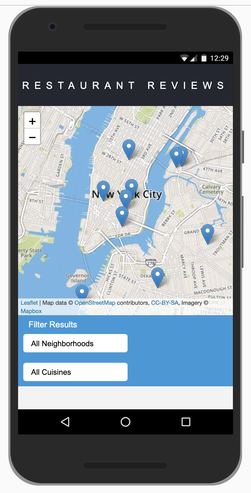
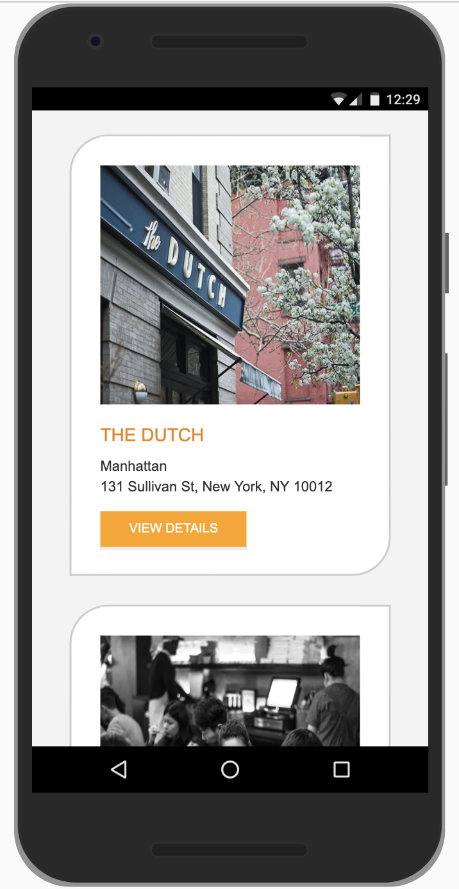
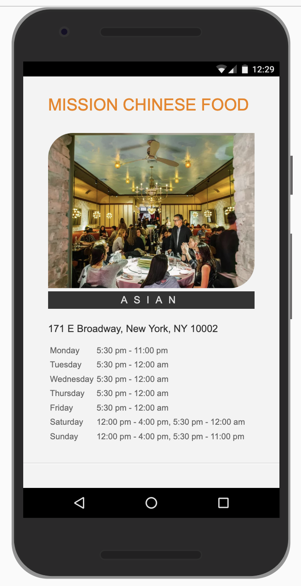
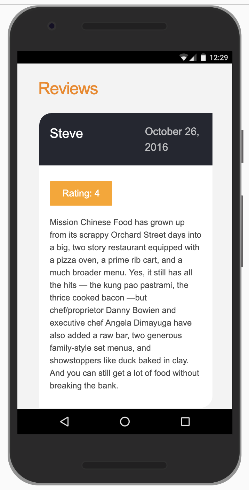

# Restaurant Reviews App

The app is developed with a mobile first approach and is fully responsive across all modern desktop, tablet, and phone browsers. The responsivenes of the app is designed using vanilla javascript. The app uses the Service Worker Web API and Cache Web API to provide effective offline experience for users. The app also implements accessibilty features by following the a11y (https://a11yproject.com/) specifications.

## Technology Used

The app is developed using HTML, CSS, JavaScript and Gulp. This app uses [leafletjs](https://leafletjs.com/) with [Mapbox](https://www.mapbox.com/) for the maps. Mapbox is free to use, and does not require any payment information.

## Install Dependencies

To install dependencies run the following command.

`npm install`

## Run

To run the application use the following commnd and access the application at `localhost:8000`.

`gulp`

Have Fun!

